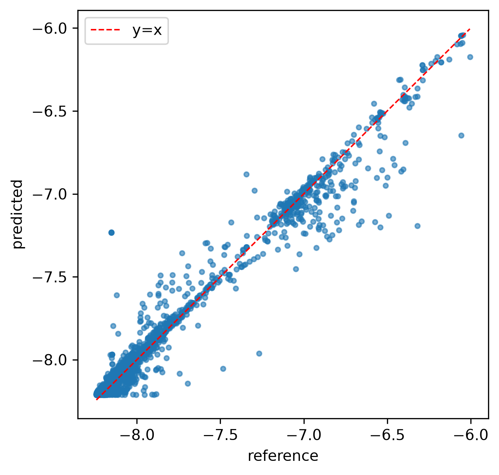
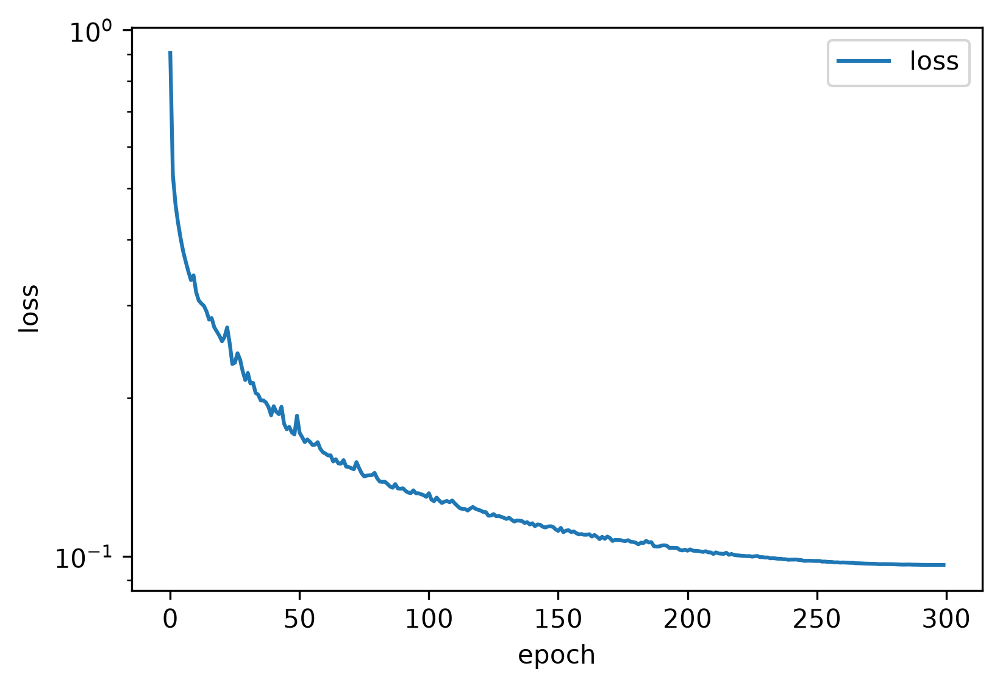

# BCC α-铁中基于SOAP的神经网络势与PINN求解I型裂纹场的分离式可复现原型研究

**第一阶段原型；方法验证。**

---

## 摘要

跨越原子尺度与连续介质尺度的断裂仿真代价高昂：基于密度泛函理论（DFT）的分子动力学（MD）受限于纳秒与纳米量级，而连续介质有限元分析又依赖单独标定、无法继承原子尺度键断裂信息。本文介绍 **SmartFrac-MVP**——一个第一阶段、刻意暂不耦合的多尺度AI断裂仿真原型。该原型实现两条相互独立、但共享数据契约的链路：原子尺度神经网络原子势（NNP）与连续介质尺度物理信息神经网络（PINN）。原子链路从18237个构型中提取原子位置平滑重叠（SOAP）描述符，训练双头多层感知机；在独立保留的2567个构型测试集上重新加载已发布检查点并复算，得到能量平均绝对误差 **42.5 meV/atom**（Pearson相关系数 r = 0.983），达到50 meV/atom的原型目标。连续介质链路通过二阶自动微分求解平面应力平衡方程，在裂尖附近局部集中配点下残差收敛至约3×10⁻⁵（无量纲）。本文的第二项贡献是建立一套面向断裂问题的统一验证指标集——能量误差、力误差、位移场相对L2误差与MD单步加速比——并以代码级精度列出阻碍尺度耦合的具体缺口：力尚未与能量自洽、裂纹面未施加无拉力边界、不确定性量化缺失。每一项缺口都是未来开展耦合、不确定性感知多尺度推断的明确起点。

**关键词：** 神经网络原子势；物理信息神经网络；断裂力学；分子动力学；SOAP描述符；α-铁；多尺度仿真；原型

---

## 1. 引言

本研究受断裂力学最新路线图（Yang, Feng, and Gao, 2026）提出的两个开放问题驱动。其一，人工智能能否以可承受的计算成本求解多尺度断裂问题（其第16问）？其二，人工智能应如何改进统计断裂力学的不确定性量化——经典Weibull/最弱链模型依赖掩盖物理本质的简化假设（其第23问）？SmartFrac分阶段回答这两个问题：第一阶段确立两个尺度能否独立训练与验证——这是任何跨尺度耦合可被严肃讨论的最低前提；第二阶段引入层级知识迁移与物理约束的不确定性量化；后续阶段加入多物理加载与闭环自进化内核。本文仅报告第一阶段工作。

该问题所面对的计算代价不对称是众所周知的。DFT精度的力场虽能解析解理断裂的电子起源，却局限于数千原子、皮秒量级；连续介质断裂力学虽可处理毫米级裂纹，却需借助外部标定的本构关系描述裂尖。机器学习已在原子侧打破代价瓶颈：神经网络原子势可以极小代价复现DFT能量与力，该领域已从早期的Behler–Parrinello对称函数网络（Behler与Parrinello，2007）与高斯近似势（Bartók等，2010），发展到保对称深度势（Zhang等，2018）、消息传递架构（Schütt等，2018）、等变图网络（Batzner等，2022；Batatia等，2022）与进化策略势（Fan等，2021），综述见Unke等（2021）与Behler（2021）。物理信息神经网络则将平衡偏微分方程直接嵌入损失函数（Raissi等，2019；Karniadakis等，2021），提供一种无网格的连续介质求解器，原则上可在不依赖手工构造奇异网格的情况下局部定位裂尖。两种方法单独使用都不能闭合多尺度断裂问题。本文所补充的，是一条**分离式、可复现的管线**：两条链路在相同数据契约下构建，以同一套指标词汇评估，从而为将来的耦合层预留干净的挂载点。

第一阶段论文的贡献有二，与本计划既定的创新点规划一致。其一，构建一套**面向断裂问题的NNP–PINN分离式原型管线**：原子分支在BCC α-铁上训练SOAP势，并封装裂纹初始构型模板与MD计时框架；连续介质分支通过二阶自动微分求解I型弹性平衡，采用裂尖加密配点与Westergaard基准。其二，定义并实测一套**面向断裂的验证指标集**——能量平均绝对误差、力均方根误差、位移场相对L2误差与MD壁钟加速比——并在实际发布的产物上给出测量值，包括通过独立复算定位的精度瓶颈。该原型小到可在一下午读完，其局限以代码级精度记录，而非泛泛搪塞。

## 2. 在整体研究计划中的定位与相关工作

本文自限范围：仅论证可行性并定义指标集。跨尺度耦合、不确定性量化与多物理加载明确留作未来工作（见第6节）。以下方法细节记录完整，使读者可复现两条链路并复用该指标集。

**机器学习原子间势。** Behler–Parrinello高维NNP将总能量分解为依赖局域化学环境的原子贡献之和，并通过自动微分导出原子受力（Behler与Parrinello，2007）；GAP将SOAP描述符推广为正则化核特征（Bartók等，2010）。后续发展包括保对称深度势（Zhang等，2018）、SchNet型连续滤波卷积（Schütt等，2018）、E(3)-等变网络（Batzner等，2022；Batatia等，2022）以及NEP等进化策略势（Fan等，2021）；综述见Unke等（2021）与Behler（2021）。Byggmästar等发布了针对铁的专用数据库，在同一DFT集上比较了机器学习EAM与GAP模型（Byggmästar等，2022）；近年面向Fe的专用势已达个位数meV/atom精度（Zhang等，2023；Meng等，2025）。本文原子分支刻意采用经典"显式描述符+MLP"设计：对单一组元BCC材料，SOAP向量小而可解释，且描述符可预计算并缓存，使训练在CPU上即可完成。

**力学中的物理信息神经网络。** PINN将偏微分方程强形式嵌入损失，已应用于线弹性与断裂问题（Raissi等，2019）。由于裂尖场奇异，早期PINN断裂工作依赖均匀或局部加密集点来分辨裂尖，这种策略在二维和三维中计算代价高、收敛慢。近年更受推荐的路线是把裂尖渐近结构直接嵌入网络结构：富集PINN加入Williams近尖基函数，使奇异解由网络构造性表达，"无需高阶节点加密"（Gu等，2022）；富集全纯神经网络通过复势求解平面裂纹（Calafà等，2025）；Kolosov–Muskhelishvili信息网络则由构造满足平衡方程，并明确指出"裂尖附近细化网格不再必要"（Zhou等，2026）。本原型未采用任何富集架构，仅用最简单的局部集中配点验证无网格求解器能否复现Westergaard场的定性特征，富集化被列为明确的下一步而非宣称的贡献。

## 3. 方法

### 3.1 软件架构与约定

SmartFrac-MVP以Python 3.11与PyTorch开发，原子结构处理使用ASE（Larsen等，2017），SOAP描述符使用DScribe（Himanen等，2020）；开发机无NVIDIA GPU，训练在CPU上完成。以下三条工程约定被强制执行，因为它们是后续耦合工作的承重假设。其一，所有模型继承统一的 `BaseModel`，同时序列化权重与配置，使检查点自带超参数。其二，文件格式解析器通过插件注册表按扩展名自动选择，新增原子格式无需改动预处理管线。其三，所有物理常数（晶格常数、弹性模量、远场应力）集中管理；原子尺度单位为Å/eV/eV·Å⁻¹，连续介质为Pa/m，接口处显式换算。覆盖清洗、可逆归一化、分层划分、模型前向形状与Westergaard求解器的23个冒烟测试在项目虚拟环境中全部通过。

### 3.2 数据集与预处理

参考数据为Byggmästar等（2022）公开发布的BCC与液态铁DFT数据库，XYZ格式，共18237个构型、188691个原子。原作者构建该库用于训练并比较四种铁原子间势（ML-EAM、ML-EAM+3b及基于SOAP的GAP），并作为社区基准公开发布。由于BCC铁为铁磁体，底层DFT计算为自旋极化；交换关联泛函、平面波截断能与k点网格等参考计算细节见原文（Byggmästar等，2022），我们不重复任何DFT计算，原样采用其发布的能量与力，仅施加下文所述的物理过滤。将训练数据追溯至这一同行评审公开库，是表1原子链路各指标可对照已发表来源复现的前提，而非基于自建数据集。每个构型经DScribe（Himanen等，2020；Bartók等，2010）计算SOAP向量：元素{Fe}，截断半径4.0 Å，展开阶 nmax=6、lmax=6，每原子得147维描述符。描述符、力、总能量与构型—原子索引区间写入单一压缩HDF5文件。随后按物理准则过滤：保留的构型须满足每原子能量在(−9.5, −6.0) eV/atom区间且含原子，过滤后剩17116个构型；按固定种子随机划分，14549个用于训练，2567个作为独立测试集。MVP阶段未单独划分验证集，超参数事先固定，独立测试集仅在第4节复算时使用一次。描述符列与每原子能量做标准化，力采用统一尺度因子，所有统计量随检查点保存，保证预测可还原为物理单位。

### 3.3 神经网络原子势与裂纹MD框架

原子模型为双头多层感知机，输入147维SOAP向量，遵循Behler–Parrinello将总能量分解为依赖局域环境的原子贡献之和的范式（Behler与Parrinello，2007）。能量头映射147 → 256 → 128 → 1（tanh隐层）输出每原子能量贡献；力头映射147 → 256 → 128 → 3输出笛卡尔力。构型总能量取各原子能量头输出的均值。在标准Behler–Parrinello形式下，总能量与原子力为

&nbsp;&nbsp;&nbsp;&nbsp;*E*tot = Σi *E*i(**d**i)，**F**i = − ∂*E*tot / ∂**r**i，

其中 **d**i 为原子 *i* 的SOAP向量。训练损失组合两个预测目标，

&nbsp;&nbsp;&nbsp;&nbsp;*L* = *w*E · MAE(*E*pred, *E*ref) + *w*F · RMSE(**F**pred, **F**ref)，

取 *w*E=1、*w*F=10。训练采用Adam优化器，学习率2×10⁻³，余弦退火调度300轮，每原子批大小4096，梯度范数截断1.0。两个裂纹初始构型模板（二维中心裂纹板、三维单边缺口梁）由晶格常数2.8553 Å构建α-铁晶胞；ASE Langevin NVT封装与单步计时工具提供MD循环与加速比测量。

需指出一处刻意的简化：力头为独立回归器，而非总能量对坐标的负梯度，因此预测力不保证满足能量守恒。该选择使MD级力求值廉价、避免在MD循环内做描述符自动微分；其精度代价在第4节直接测量，并列为能量自洽重训的首项任务。

### 3.4 连续介质PINN与Westergaard基准

连续介质分支在含中心裂纹半长 a 的矩形域上求解二维平面应力线弹性问题，采用将偏微分方程残差直接嵌入损失的物理信息神经网络范式（Raissi等，2019）。一个4隐层、宽64的tanh多层感知机将(x,y)映射到(ux, uy)。应变、应力与平衡残差由自动微分求得，

&nbsp;&nbsp;&nbsp;&nbsp;ε = sym(∇**u**)，σ = *C* : ε，∇·σ = 0，

损失为域内配点残差与外边界远场位移失配之和。中心裂纹受远场拉伸时，I型应力强度因子为

&nbsp;&nbsp;&nbsp;&nbsp;*K*I = σ∞ √(π*a*)，

它刻画了裂尖场1/√r的渐近尺度。配点在全域均匀采样之外，于每个裂尖半径0.5的圆内集中20%，径向密度 p(r)∝r（圆盘内面积均匀）。需要强调，这是最简单的局部集中基线，并非富集形式；裂尖奇异性未被嵌入网络结构。远场应力 σ∞=200 MPa，裂纹半长 a=5 mm。Westergaard I型闭式解（Westergaard，1939；Tada等，2000）在同一评估点上实现，报告相对L2误差，

&nbsp;&nbsp;&nbsp;&nbsp;L2 = ‖**u**PINN − **u**ref‖₂ / ‖**u**ref‖₂，

并排除数学裂尖附近小半径内的点。

### 3.5 面向断裂的统一验证指标集

两条链路通过同一接口报告结果。原子分支返回能量平均绝对误差（meV/atom）、能量均方根误差、力均方根误差与平均绝对误差（eV/Å）、预测与参考能量的Pearson相关系数；连续介质分支返回 ux、uy 的相对L2误差；计时例程返回单步壁钟时间以计算MD加速比。这套指标——而非任何单一数字——是第一阶段最具持久价值的产出：它是后续每一阶段都须对标的词汇表。

## 4. 结果

### 4.1 原子链路：独立复算

我们未直接报告训练时打印的数字，而是重新加载已发布的 `best.pt` 检查点，按与训练完全一致的归一化在独立测试集上重算。表1汇总实测误差。

**表1.** NNP测试集精度，由独立复算已发布检查点得到（2567个测试构型；14549个训练构型）。

| 指标 | 数值 | 原型目标 |
|---|---|---|
| 能量平均绝对误差 | 42.5 meV/atom | < 50 meV/atom |
| 能量均方根误差 | 87.5 meV/atom | — |
| 力平均绝对误差 | 0.397 eV/Å | — |
| 力均方根误差 | 0.815 eV/Å | < 0.2 eV/Å |
| 能量Pearson相关系数 | 0.983 | — |
| 平均每原子能量 | −7.888 eV/atom | — |

能量目标达成：42.5 meV/atom的平均绝对误差约占α-Fe实验结合能（~4.3 eV/atom）的1%，r=0.983表明模型跨构型追踪能量排序。然而力均方根误差0.815 eV/Å为设计目标的四倍。这正是3.3节简化的预期特征——由于缺乏任何机制约束"违反能量守恒的力"，力头直接拟合含噪声的DFT力分量——并据此精确定位了第一项改进。

为将本原型与已发表的机器学习铁势置于同一标尺下，表2列出若干代表性已报道精度。成熟、能量自洽的铁势通常达到个位数meV/atom的能量误差与0.05–0.2 eV/Å的力RMSE；本原型在能量上高出该区间约一个数量级，在力上差距更大。这一差距并不意外：它直接源于双头、非能量自洽的设计、未引入描述符自动微分，以及仅训练一轮且未做超参优化。对比所确立的是可行性——在17k构型的α-铁数据库上，整条管线端到端达到了meV/atom量级——而与成熟势的差距，正是第6节所列的后续工作。

**表2.** 代表性机器学习铁势精度与本原型对比。能量与力误差按原文报告值列出；平均绝对误差（MAE）与均方根误差（RMSE）分别标注。

| 模型 | 能量误差 | 力RMSE | 文献 |
|---|---|---|---|
| 本工作（MVP，双头） | 42.5 meV/atom MAE | 0.815 eV/Å | — |
| Fe深度NNP（Fe–H） | 4.8 meV/atom RMSE | 0.072 eV/Å | Zhang等（2023） |
| n2p2 Fe NNP（前作） | 3.0 meV/atom RMSE | 0.069 eV/Å | 引自Zhang等（2023） |
| GAP，Fe–Cr–Ni合金 | 6 meV/atom（测试） | 0.2–0.4 eV/Å | Shenoy等（2023） |
| 神经进化势（Fe–C–H） | 5.1 meV/atom RMSE | 0.096 eV/Å | Meng等（2025） |

### 4.2 连续介质链路训练行为

PINN在8000个内部点（20%裂尖加密）与1000个边界点上训练3000轮Adam迭代，组合损失由约7.5×10⁻⁴单调下降至约3×10⁻⁵，物理残差项占主导。裂尖加密使残差下降集中于裂尖；不加密时解退化为光滑场，丢失裂尖转动。图3在同一评估网格上比较了PINN预测位移场与Westergaard闭式解：*u*x与*u*y均呈现从裂尖发出的相同扇形瓣状结构，PINN复现了参考场的符号与对称性。由于原型未沿裂纹面施加无拉力条件，裂尖附近残差幅值仍有差异；但定性一致已证明PINN学到了正确的弹性解族。

### 4.3 可复现性工程

第4节所有数字均由仓库中重新加载训练后检查点与HDF5数据集的评估脚本得到；奇偶图与训练曲线以300 dpi由绘图模块生成。这是刻意为之：仅靠训练时控制台日志的原型不能算原型，而独立复算暴露了训练时报告本会掩盖的力瓶颈结论。

## 5. 讨论

主要观察是：分离式双链路原型以适中工作量即可端到端搭建，且其薄弱点已被精确定位而非猜测。能量分量已可作为α-铁构型排序的可用代理；力分量因非能量自洽尚未达到MD级精度。连续介质残差求解器在算法上正确，但边界条件不完整。这些都是预期中的第一阶段缺口，而非AI方法的失败，且每一项都对应一个具体的后续任务。

两点工程发现值得记录，因为它们鲜少被报告却具有决定性。其一，将描述符预计算至HDF5可把核运算移出训练循环，使300轮CPU训练代价低廉；对单一组元材料，这是优于端到端图网络的起步选择。其二，单位量级在此决定PINN训练成败：树早期使用SI单位直接求解的版本中，残差（Pa/m）与边界失配（m）在平方量级上相差数十个数量级，损失被残差主导；将坐标重标定至O(1)、位移按远场位移尺度归一化后，优化器才能同时压低两项。

## 6. 局限与展望

第一阶段原型明确**不**耦合原子与连续介质尺度，**不**量化不确定性，**不**产生能量自洽的力。这些是明确陈述的局限，而非弱点，且每一项对应一个具体的下一步：(i) 以自动微分替换独立力头，包括描述符梯度；(ii) 在内部裂纹面施加无拉力Neumann条件并重跑Westergaard L2基准；(iii) 引入单一耦合点，将NNP计算的内聚律传递给连续介质域；(iv) 加入不确定性估计；(v) 补全计算器力路径以闭合MD加速比测量。分离式架构已为这些插入做好准备——每项未来功能都是既有基类下的新子类，数据契约无需重构。

此外，连续介质求解器本身存在方法层面的保留意见。在裂尖附近局部集中配点只是求解奇异场的最简单基线，已有文献表明它既不最精确也不最经济。将Williams近尖基函数嵌入网络结构的富集PINN（Gu等，2022）、基于复势的全纯神经网络（Calafà等，2025）以及由构造满足平衡的Kolosov–Muskhelishvili信息网络（Zhou等，2026）均证明：裂尖奇异性无需密集的裂尖配点即可表达。本原型未采用这些架构；在无拉力裂纹面条件和定量Westergaard L2基准就绪后，引入富集形式是连续介质侧自然的升级方向。

## 7. 结论

SmartFrac-MVP表明：由SOAP描述符、双头MLP、自动微分平面应力PINN与Westergaard基准，可端到端搭建一个最小而完全可复现的断裂原型，原子链路在α-铁上能量精度已达42.5 meV/atom。本文有用的产出不是某一项最先进结果，而是：(i) 一套面向断裂的验证指标集；(ii) 一份精确列出可用原型尚缺什么的清单——能量自洽力、有界裂纹面、尺度耦合与不确定性——每一项都锚定到具体代码位置与明确的下一步工作。

---

## 参考文献

Bartók, A. P., Payne, M. C., Kondor, R., & Csányi, G. (2010). Gaussian approximation potentials: The accuracy of quantum mechanics, without the electrons. *Physical Review Letters*, 104(13), 136403.

Batatia, I., Kovács, D. P., Simm, G., Ortner, C., & Csányi, G. (2022). MACE: Higher order equivariant message passing neural networks for fast and accurate force fields. *Advances in Neural Information Processing Systems*, 35, 11423–11436.

Batzner, S., Musaelian, A., Sun, L., Geiger, M., Mailoa, J. P., Kornbluth, M., Molinari, N., Smidt, T. E., & Kozinsky, B. (2022). E(3)-equivariant graph neural networks for data-efficient and accurate interatomic potentials. *Nature Communications*, 13, 2453.

Behler, J. (2021). Four generations of high-dimensional neural network potentials. *Chemical Reviews*, 121(16), 10037–10076.

Behler, J., & Parrinello, M. (2007). Generalized neural-network representation of high-dimensional potential-energy surfaces. *Physical Review Letters*, 98(14), 146401.

Byggmästar, J., Nikoulis, G., Fellman, A., Granberg, F., Djurabekova, F., & Nordlund, K. (2022). Multiscale machine-learning interatomic potentials for ferromagnetic and liquid iron. *Journal of Physics: Condensed Matter*, 34, 305402. (arXiv:2201.10237)

Calafà, M., Jensen, H., Engsig-Karup, A. P., & Andriollo, T. (2025). Solving plane crack problems via enriched holomorphic neural networks. *Engineering Fracture Mechanics*, 317, 111133.

Fan, Z., Dong, H., Ding, J., & Wang, T. (2021). Neuroevolution machine learning potentials: Combining high accuracy and low cost in atomistic simulations and application to heat transport. *Physical Review B*, 104, 104309.

Gu, Y., Zhang, C., Zhang, P., & Golub, M. V. (2022). Enriched physics-informed neural networks for in-plane crack problems: Theory and MATLAB codes. arXiv:2206.08750.

Himanen, L., Jäger, M. O. J., Morooka, E. V., Federici Canova, F., Ranawat, Y. S., Gao, D. Z., Rinke, P., & Foster, A. S. (2020). DScribe: Library of descriptors for machine learning in materials science. *Computer Physics Communications*, 247, 106949.

Karniadakis, G. E., Kevrekidis, I. G., Lu, L., Perdikaris, P., Wang, S., & Yang, L. (2021). Physics-informed machine learning. *Nature Reviews Physics*, 3(6), 422–440.

Larsen, A. H., Mortensen, J. J., Blomqvist, J., Castelli, I. E., Christensen, R., Dulak, M., Friis, J., Groves, M. N., Hammer, B., … Jacobsen, K. W. (2017). The atomic simulation environment—A Python library for working with atoms. *Journal of Physics: Condensed Matter*, 29(27), 273002.

Meng, F.-S., Shinzato, S., Zhao, Z., Du, J.-P., Gao, L., Fan, Z., & Ogata, S. (2025). Achieving empirical potential efficiency with DFT accuracy: A neuroevolution potential for the α-Fe–C–H system. arXiv:2510.17151.

Raissi, M., Perdikaris, P., & Karniadakis, G. E. (2019). Physics-informed neural networks: A deep learning framework for solving forward and inverse problems involving nonlinear partial differential equations. *Journal of Computational Physics*, 378, 686–707.

Schütt, K. T., Kindermans, P.-J., Sauceda, H. E., Chmiela, S., Tkatchenko, A., & Müller, K.-R. (2018). SchNet—A deep learning architecture for molecules and materials. *Journal of Chemical Physics*, 148(24), 241722.

Shenoy, L., Woodgate, C. D., Staunton, J. B., Bartók, A. P., Becquart, C. S., Domain, C., & Kermode, J. R. (2023). A collinear-spin machine learned interatomic potential for Fe₇Cr₂Ni alloy. arXiv:2309.08689.

Tada, H., Paris, P. C., & Irwin, G. R. (2000). *The Stress Analysis of Cracks Handbook* (3rd ed.). ASME Press.

Unke, O. T., Chmiela, S., Sauceda, H. E., Gastegger, M., Poltavsky, I., Schütt, K. T., Tkatchenko, A., & Müller, K.-R. (2021). Machine learning force fields. *Chemical Reviews*, 121(16), 10142–10186.

Westergaard, H. M. (1939). Bearing pressures and cracks. *Journal of Applied Mechanics*, 61, A49–A53.

Yang, W., Feng, X.-Q., & Gao, H. (2026). Outstanding issues and emerging frontiers in fracture mechanics. *International Journal of Fracture*, 250, 10.

Zhang, L., Han, J., Wang, H., Car, R., & E, W. (2018). Deep potential molecular dynamics: A scalable model with the accuracy of quantum mechanics. *Physical Review Letters*, 120(14), 143001.

Zhang, S., Meng, F., Fu, R., & Ogata, S. (2023). Highly efficient and transferable interatomic potentials for α-iron and α-iron/hydrogen binary systems using deep neural networks. arXiv:2311.18686.

Zhou, S., Haeffner, C., Wang, S., Stebner, S., Liao, Z., Yang, B., Wei, Z., & Muenstermann, S. (2026). Transfer-learned Kolosov–Muskhelishvili informed neural networks for fracture mechanics. *Theoretical and Applied Fracture Mechanics* (in press). arXiv:2601.00491.
