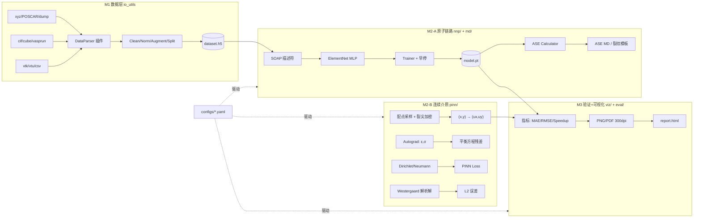

# SmartFrac 第一阶段（MVP）开发设计说明书

> 依据：《多尺度‑不确定性耦合AI断裂智能仿真系统_第一阶段需求V1.0》
> 设计基线：Python 3.11.9 + PyTorch 2.x(CPU/GPU) + ASE + DScribe + OmegaConf + pytest
> 材料基准：α‑Fe (BCC)，E=210 GPa，ν=0.3，远场 σ∞=200 MPa，中心裂纹 2a=10 mm

---

## 1. 总体架构



**核心原则**（对应 NFR‑1/2/3/6）：
- 所有模型继承 `BaseModel`，新增算法只加子类；
- 数据格式解析走 `DataParser` 插件注册表；
- 网络结构、训练超参、物理常数全部 YAML 驱动；
- 物理常数集中在 `constants.py`，禁止散落。

---

## 2. 包结构（最终落地形态）

```
SmartFrac/
├── main.py                       # CLI 入口
├── configs/
│   ├── default.yaml              # 全局默认
│   ├── nnp_alpha_fe.yaml         # NNP α-Fe 算例
│   ├── pinn_center_crack.yaml    # PINN 中心裂纹算例
│   └── data_splits.yaml          # 数据划分策略
├── src/smartfrac/
│   ├── __init__.py
│   ├── constants.py              # 物理常数/单位制（NFR-6）
│   ├── core/
│   │   ├── base_model.py         # BaseModel(NNP/PINN 公共接口)
│   │   ├── base_trainer.py       # Trainer 模板: train/validate/early_stop
│   │   ├── registry.py          # Parser/Model 插件注册表
│   │   └── datatypes.py         # Dataset / FieldData 数据类契约
│   ├── io_utils/
│   │   ├── parsers/             # FR-1.1~1.4 插件
│   │   │   ├── base.py          # DataParser.parse()->Dataset
│   │   │   ├── xyz_parser.py
│   │   │   ├── poscar_parser.py
│   │   │   ├── lammps_dump_parser.py
│   │   │   ├── cif_parser.py
│   │   │   ├── cube_parser.py
│   │   │   ├── vasp_parser.py
│   │   │   └── vtk_parser.py
│   │   ├── cleaning.py           # FR-1.5 NaN/Inf 剔除 + 日志
│   │   ├── normalization.py      # FR-1.6/1.7 坐标+能量/力归一化(可逆)
│   │   ├── dedup.py             # FR-1.8 SOAP 指纹去重
│   │   ├── augment.py           # FR-1.12 扰动/晶胞变形增广
│   │   ├── split.py             # FR-1.9 分层 70/15/15
│   │   └── h5store.py           # FR-1.11 HDF5 读写 + metadata JSON
│   ├── nnp/
│   │   ├── descriptor.py        # SOAP 封装(DScribe)
│   │   ├── model.py             # ElementEnergyNet: D->E_i -> E_total
│   │   ├── loss.py              # FR-2.3 E-MAE + F-RMSE 加权
│   │   ├── trainer.py           # FR-2.4/2.5/2.6 训练循环+早停+TB
│   │   ├── ase_calculator.py    # FR-2.7 自定义 PyTorch Calculator
│   │   └── metrics.py           # FR-2.10 energy_mae/force_rmse/stress_mae
│   ├── pinn/
│   │   ├── pde.py               # FR-3.1/3.2 线弹性本构+平衡方程残差
│   │   ├── model.py             # MLP (x,y)->(ux,uy)
│   │   ├── bc.py                # FR-3.3 Dirichlet/Neumann/远场应力
│   │   ├── sampling.py          # FR-3.6 均匀+裂尖 r² 加密
│   │   ├── trainer.py           # 物理残差+边界+数据损失加权
│   │   └── benchmarks/
│   │       ├── westergaard.py   # FR-3.7 I 型解析解
│   │       └── fem_loader.py    # FR-3.8 .vtu/.csv FEM 基准
│   ├── md/
│   │   ├── crack_templates.py    # FR-2.8 SEB/CC 二维/三维构型
│   │   ├── runner.py            # FR-2.9 NVT/能量演化/键断裂统计
│   │   └── speedup.py           # FR-2.11 单步耗时对比
│   ├── viz/
│   │   ├── atomic.py             # FR-4.1/4.2 pyvista 原子快照+散点
│   │   ├── field.py             # FR-4.4/4.5 位移/应力云图+等值线
│   │   ├── curves.py            # FR-4.3/4.6/4.7 loss/parity/剖面对比
│   │   └── report.py            # FR-4.8 HTML 报告
│   └── eval/
│       ├── nnp_eval.py          # 接口B: 指标字典
│       └── pinn_eval.py         # 接口C: L2/R²
├── examples/                     # NFR-5: 30分钟跑通 demo
│   ├── 01_prepare_dataset.py
│   ├── 02_train_nnp.py
│   ├── 03_run_md.py
│   ├── 04_solve_pinn.py
│   └── 05_make_report.py
├── tests/
│   ├── test_cleaning.py
│   ├── test_normalization.py
│   ├── test_split.py
│   ├── test_descriptor.py
│   ├── test_nnp_model.py
│   ├── test_pinn_pde.py
│   ├── test_westergaard.py
│   └── test_viz_smoke.py
├── data/                         # raw/ processed/(h5)
├── results/                      # run_YYYYMMDD_HHMMSS/
└── docs/
    └── design_first_stage.md     # 本文档
```

---

## 3. 核心数据契约（接口 A/B/C/D）

### 3.1 `core/datatypes.py`

```python
@dataclass
class AtomicSample:
    numbers: np.ndarray          # (N,) 元素序号
    positions: np.ndarray        # (N,3) Å
    cell: np.ndarray             # (3,3)
    energy: float | None          # eV
    forces: np.ndarray | None    # (N,3) eV/Å
    stress: np.ndarray | None     # (6,) Voigt

@dataclass
class Dataset:
    descriptors: np.ndarray | None  # (M, D_desc) 已算好的描述符
    positions: np.ndarray           # (M, N, 3) 或变长列表
    energies: np.ndarray            # (M,)
    forces: np.ndarray              # (M, N, 3)
    metadata: dict                  # 元素/能量范围/归一化参数/划分/seed

@dataclass
class FieldData:
    coords: np.ndarray          # (K,2) 或 (K,3)
    ux: np.ndarray; uy: np.ndarray
    sxx: np.ndarray; syy: np.ndarray; sxy: np.ndarray
    meta: dict                  # 物理量名/单位/色标范围
```

**接口 A**：M1 → M2-A，`Dataset` 对象 + metadata 必含 `elements, energy_range, norm_params, split, seed`。
**接口 B**：M2-A → eval，`(ckpt_path, pred_energies, pred_forces)` → `metrics = {energy_mae_meV, force_rmse_eV_A, stress_mae, speedup}`。
**接口 C**：M2-B → eval，`(FieldData, ref)` → `{L2_rel, R2}`。
**接口 D**：eval → viz，`FieldData + meta`，可视化层按 meta 自动选渲染器。

---

## 4. M1 数据预处理模块详细设计

### 4.1 Parser 插件机制（NFR‑2）

```python
# core/registry.py
PARSER_REGISTRY: dict[str, type[DataParser]] = {}

def register_parser(ext: str):
    def deco(cls): PARSER_REGISTRY[ext] = cls; return cls
    return deco

# io_utils/parsers/base.py
class DataParser(ABC):
    @abstractmethod
    def parse(self, path: Path) -> list[AtomicSample]: ...

# 使用：按文件后缀自动选 parser
```

| 格式 | Parser | 来源库 |
|---|---|---|
| .xyz | XYZParser | ASE.io.read |
| .POSCAR | PoscarParser | ASE read |
| .dump | LammpsDumpParser | 自写正则（读步数/盒子/原子） |
| .cif | CifParser | ASE read |
| .cube | CubeParser | ase.io.cube |
| vasprun.xml | VaspParser | pymatgen 可选 / ASE read |
| .vtu/.csv | VTKFieldParser | pyvista.read |

### 4.2 清洗与归一化管线

```
raw files
  → filter_invalid       # FR-1.5: 丢 NaN/Inf，记录 log
  → dedup_by_soap        # FR-1.8: SOAP 指纹哈希去重
  → normalize_coords     # FR-1.6: min-max 到 [0,1]^cell，记录 cell 参数
  → normalize_labels     # FR-1.7: (E-mean)/std, F 同尺度；写 norm_params.json
  → augment              # FR-1.12: ±0.05Å 扰动，标记 augment=True
  → stratified_split     # FR-1.9: 按能量区间分层 70/15/15
  → to_hdf5              # FR-1.11: descriptors + labels + metadata.json
```

- **FR‑1.6/1.7 可逆**：`Normalizer` 对象保存 `mean_/std_/cell_`，提供 `inverse_transform()`。
- **FR‑1.8 去重**：对每个构型计算粗粒度 SOAP 描述符，哈希到 64 位桶，桶内余弦距离 < 0.999 判重。
- **FR‑1.10 元数据**：`{source, n_samples, species, e_min, e_max, split_ratio, seed, aug_count}`。

---

## 5. M2-A NNP 模块详细设计

### 5.1 模型（FR‑2.1/2.2）

**物理形式**：总能量为原子能量贡献之和，力由自动微分得到：
```
E_total = Σ_i E_i(descr_i, species_i)
F_i     = -∂E_total / ∂r_i
```

- **描述符**：DScribe SOAP（`r_cut/n_max/l_max` 走配置，默认 5.0 Å / 8 / 6）。
- **网络**：每种元素一个 MLP（element‑specific embedding），层数 3~5、宽度 64/128/256、激活 Tanh/ReLU/SiLU 全为配置项。
- **输出**：每原子标量能量贡献（eV）。
- **GPU**：`.to(device)`，descriptor 阶段在 CPU 算好后喂 GPU。

### 5.2 损失（FR‑2.3）

```
L = w_E * MAE(E_pred, E_true)      # 默认 1.0
  + w_F * RMSE(F_pred, F_true) / N_atom   # 默认 10.0，按原子数归一
```

### 5.3 训练循环（FR‑2.4/2.5/2.6）

- 配置：`lr, batch_size, epochs, optimizer(adamw), scheduler(plateau), early_stop.patience=50`。
- 每 epoch 记录：train/val loss、energy MAE、force RMSE → TensorBoard + CSV。
- Checkpoint：最优 val 指标 `best.pt`，最终 `last.pt`，均保存 `norm_params` 与模型结构。
- 训练曲线输出 `loss_curve.png`（300 dpi）。

### 5.4 ASE Calculator（FR‑2.7）

```python
class NNP_ASE(ase.calculators.calculator.Calculator):
    implemented_properties = ["energy", "forces"]
    def calculate(self, atoms, ...):
        descr = soap.transform(atoms)
        E = self.model(descr, atoms.numbers)
        F = -autograd.grad(E, atoms.positions)   # requires_grad
```

**降级方案**（风险节）：LAMMPS ML‑IAP 集成放第二阶段；MVP 直接用 ASE+PyTorch Calculator 跑小体系 MD。

### 5.5 裂纹构型模板（FR‑2.8）

- `make_cc_2d()`：中心裂纹板，在指定 x 区间删除原子形成裂纹；
- `make_seb_3d()`：单边缺口梁；
- 输出 `Atoms` 对象 + 边界条件标记（底边固定、顶边位移加载）。

### 5.6 MD 运行与指标（FR‑2.9/2.10/2.11）

- ASE `NVTBerendsen` / `NVE`，预置 10000 步模板；
- 输出：`trajectory.xyz`、`energy_log.csv`、`crack_length.csv`（键断裂判定：邻居距离 > 1.2×平衡键长）；
- `speedup.py`：同体系同步数，NNP‑MD vs EAM‑MD 单步 wall‑time，目标 ≥10×。

---

## 6. M2-B PINN 模块详细设计

### 6.1 物理（FR‑3.1/3.2）

二维线弹性各向同性平面应力/应变：
```
σ = C(ν,E):ε,   ε = sym(∇u),   ∇·σ = 0
```
由 PyTorch autograd：
- `u_x, u_y = NN(x, y)`（requires_grad）
- `ε_xx = ∂u_x/∂x`, `ε_yy = ∂u_y/∂y`, `ε_xy = 0.5(∂u_x/∂y + ∂u_y/∂x)`
- `σ_xx, σ_yy, σ_xy` 由本构推出
- 残差：`r_x = ∂σ_xx/∂x + ∂σ_xy/∂y`, `r_y = ∂σ_xy/∂x + ∂σ_yy/∂y`

### 6.2 损失（FR‑3.5）

```
L = w_pde * mean(r_x² + r_y²)          # 域内配点
  + w_dir * mean((u - u_bc)²)          # Dirichlet
  + w_neu * mean((traction - t_bc)²)  # Neumann
  + w_data * mean((u - u_ref)²)        # 验证阶段可选
```
裂尖区域权重 ×5~10（风险应对）。

### 6.3 配点采样（FR‑3.6）

- 域内均匀采样 N=10000；
- 裂尖半径 r<R_tip 内按 `p(r) ∝ 1/r`（题目要求 r² 加密 → 实现时 `N_tip ∝ r² dr`）局部加密 20%；
- 边界点 1000。

### 6.4 基准（FR‑3.7/3.8）

**Westergaard I 型解析解**（中心裂纹，远场 σ∞）：
```
K_I = σ∞ sqrt(π a)
u_x, u_y 由 Westergaard 复势给出（closed-form 写在 westergaard.py）
```
PINN 训练完成后，在同一批 (x,y) 上对比 ux/uy，输出 L2 相对误差：
```
L2 = ||u_pinn - u_ref|| / ||u_ref||
```
目标 < 2%（TC‑05）。FEM 基准通过 `VTKFieldParser` 读 .vtu 做逐点插值对比。

---

## 7. M3 可视化与报告

| 需求 | 实现 | 输出 |
|---|---|---|
| FR‑4.1 原子快照 | pyvista 按元素着色 | PNG 300dpi |
| FR‑4.2 原子能量散点 | matplotlib scatter + colorbar | PNG/PDF |
| FR‑4.3 训练曲线 | matplotlib 多曲线叠加 | PNG |
| FR‑4.4/4.5 应力云图 | pyvista 2D 云图 + 裂尖局部放大 | PNG |
| FR‑4.6 parity plot | matplotlib y=x 参考线 + 直方图 | PNG |
| FR‑4.7 剖面曲线 | 沿路径插值对比 | PNG |
| FR‑4.8 HTML 报告 | Jinja2 模板拼接图表+metrics | report.html |

---

## 8. 配置 / CLI / 结果目录

### 8.1 配置（FR‑IO.1）

`configs/default.yaml` 为基，算例 config 通过 OmegaConf `--config` 组合覆写。关键段：`project/device/data/nnp/pinn/md/viz`。

### 8.2 CLI（FR‑IO.2）

```powershell
python main.py prepare --config configs/nnp_alpha_fe.yaml
python main.py train-nnp --config configs/nnp_alpha_fe.yaml
python main.py run-md   --config configs/nnp_alpha_fe.yaml
python main.py train-pinn --config configs/pinn_center_crack.yaml
python main.py report   --config configs/...
```

### 8.3 结果目录（FR‑IO.3）

```
results/run_20260913_153000/
├── model_checkpoint.pt
├── metrics.json
├── config_used.yaml
├── figures/
├── predictions/
└── report.html
```

---

## 9. 测试策略（NFR‑4，覆盖率 ≥70%）

| 层 | 测试内容 |
|---|---|
| 单元 | cleaning/dedup/normalization 可逆性；SOAP 输出维度；NNP 前向+力 autograd；PINN PDE 残差在恒定位移下为 0；Westergaard 解析解符号 |
| 集成 | 小数据集(20 构型)端到端 train→save→load→predict；HDF5 往返一致性 |
| 回归 | TC‑01~TC‑08 对应 pytest 用例 |

CI 命令：`pytest tests/ --cov=smartfrac --cov-fail-under=70`。

---

## 10. 里程碑任务拆解（对应 12 个月计划）

| 月 | 任务 | 交付 |
|---|---|---|
| M1 (1‑3) | constants/core/registry、M1 全部 Parser + 清洗/归一化/划分/HDF5；examples/01 | 数据管线 + 环境文档（TC‑01/02） |
| M2 (3‑6) | NNP model/loss/trainer + ASE Calculator + 裂纹模板 + speedup | α‑Fe NNP ckpt + 加速比报告（TC‑03/04/06） |
| M3 (5‑8) | PINN pde/bc/sampling + Westergaard + FEM loader | 位移场 L2<2%（TC‑05） |
| M4 (8‑10) | viz 全部 + HTML 报告 + examples 02~05 | MVP Demo（TC‑07） |
| M5 (10‑12) | 全量回归 + 验收报告 + 软著 + SCI 初稿 | 全套交付物（TC‑08） |

---

## 11. 验收对照（TC‑01 ~ TC‑08）

| TC | 需求 | 对应模块/用例 | 通过标准 |
|---|---|---|---|
| 01 | 1000 构型导入 | test_parsers | 无错、metadata 完整 |
| 02 | 清洗+归一化可逆 | test_normalization | 无 NaN，inverse 还原误差 <1e-6 |
| 03 | NNP 收敛 | test_nnp_train | E MAE<50 meV/atom, F RMSE<0.2 eV/Å |
| 04 | MD 起裂 | test_md_10k | 10k 步无崩溃，裂纹时刻可识别 |
| 05 | PINN 精度 | test_pinn_westergaard | L2<2% |
| 06 | 加速比 | test_speedup | ≥10× |
| 07 | 可视化 | test_viz_smoke | 4 类图各 ≥1 张 PNG |
| 08 | 一键复现 | examples/01~05 | 新环境跑通 |

---

## 12. 第一阶段明确不做（边界）

多尺度串联 / CNN 微观组织 / RL 判据 / 完整不确定性传播 / PyQt5 GUI / Celery 调度 / FastAPI / LAMMPS‑MLIAP 集成 / FEniCSx 正式耦合。以上全部排入第二阶段，MVP 仅留接口（`BaseModel` 子类挂载点、`DataParser` 注册表）。
