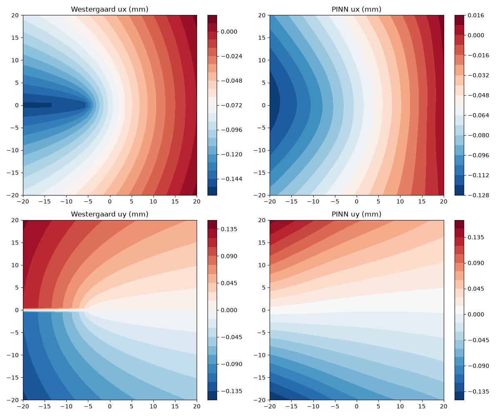

# SmartFrac: A Separated NNP–PINN Prototype for Multiscale Fracture Simulation in BCC α-Iron

**First Author***, Second Author, and Third Author

*<Department, University, City, Country>*
*Corresponding author: <email>*

**Software metadata.** Python 3.11 / PyTorch; CPU-only training; source code, training checkpoint, and prebuilt HDF5 descriptor: https://github.com/shishijingyu/SmartFrac . License: MIT.

---

## Abstract

SmartFrac is a deliberately minimal, fully reproducible Python prototype for multiscale AI fracture simulation in BCC α-iron. It assembles two independent but contract-sharing links behind one code base: an atomic-scale neural network potential (NNP) trained with smooth-overlap-of-atomic-positions (SOAP) descriptors on a public DFT iron database, and a continuum-scale physics-informed neural network (PINN) solving the two-dimensional plane-stress Mode-I crack problem against the Westergaard closed form. The atomic link, independently re-evaluated on a held-out 2,567-configuration split, reaches an energy mean absolute error of 42.5 meV/atom (Pearson *r* = 0.983); the full training run completes on a modern multi-core CPU. The continuum link reduces the autodifferentiated equilibrium residual to ≈3 × 10⁻⁵ with locally concentrated collocation. The software exposes one unified metric set—energy error, force error, relative field L2 error, and MD wall-time speed-up—so that every later extension can be measured against the same baseline. It is intended as a teaching and research scaffold for coupling NNP and PINN links, not as a state-of-the-art fracture solver; its known limitations are documented to code-level precision.

**Keywords:** neural network potential; physics-informed neural network; fracture mechanics; SOAP descriptor; BCC α-iron; multiscale simulation

---

## 1. Introduction

Fracture simulation across atomistic and continuum scales is expensive: density-functional-theory (DFT)-based molecular dynamics (MD) is confined to nanoseconds and nanometres, while continuum finite-element analyses require separately calibrated constitutive laws that do not inherit the atomistic picture of bond rupture. Two open questions identified in the recent fracture-mechanics roadmap of Yang, Feng, and Gao (2026) frame the broader agenda: can artificial intelligence compute multiscale fracture problems at affordable cost (their Issue 16), and how should AI improve the uncertainty quantification of statistical fracture mechanics (their Issue 23)?

Machine learning has broken the cost barrier on the atomic side: neural-network potentials reproduce DFT energies and forces at a small fraction of the cost, from the Behler–Parrinello decomposition (Behler and Parrinello, 2007) and the Gaussian approximation potential (Bartók et al., 2010) through deep potentials (Zhang et al., 2018), SchNet (Schütt et al., 2018), equivariant graph networks (Batzner et al., 2022; Batatia et al., 2022) and evolutionary strategies such as NEP (Fan et al., 2021); reviews are given by Unke et al. (2021) and Behler (2021). On the continuum side, physics-informed neural networks embed the equilibrium PDE directly into the loss (Raissi et al., 2019; Karniadakis et al., 2021), offering a mesh-free solver.

What does not yet exist as a lightweight, open, reproducible reference is a **single code base that contains both links behind the same data contracts and the same metric vocabulary**, so that a student or a new group can read it in an afternoon, re-run both links on CPU, and see exactly what works and what does not. SmartFrac fills this gap. It is not a state-of-the-art fracture solver; it is a scaffold whose weak points are localised rather than hidden.

## 2. Motivation and significance

Several mature packages cover the atomic side alone—LAMMPS with machine-learning potentials, n2p2, SchNetPack, MACE—while several PINN frameworks cover PDE solvers alone. Combining them for a fracture study still requires the user to write the glue: descriptors, HDF5 storage, a checkpoint that carries its own normalisation, a Westergaard evaluator, a timing harness, and a metric interface that means the same number on both sides. When a result disagrees with a benchmark, the debugging effort is spent in this glue rather than in the science.

SmartFrac's significance is therefore threefold:

1. **One code base, two links.** The atomic NNP and the continuum PINN live in the same package, behind a common `BaseModel` that serialises weights together with configuration and normalisation statistics. A checkpoint is self-describing.
2. **One metric vocabulary.** Both links return through one interface—energy MAE/RMSE, force MAE/RMSE, Pearson *r*, relative displacement-field L2 error, MD single-step wall time. Future coupling work is held to the same numbers.
3. **Honest, CPU-runnable baseline.** The whole pipeline trains on CPU; no GPU is required. The known gaps—non-energy-consistent forces, missing crack-face traction-free condition, no enriched-tip formulation, no uncertainty quantification—are documented explicitly and tied to concrete code locations, so that the next contributor does not have to re-derive them.

The target audience is graduate students and researchers starting an AI-for-fracture project who want a minimal, readable reference rather than a black-box production framework.

## 3. Software description

### 3.1 Installation and quick start

SmartFrac requires Python 3.11 and depends on PyTorch, ASE, DScribe, h5py, NumPy and Matplotlib. From a fresh checkout:

```bash
git clone https://github.com/shishijingyu/SmartFrac.git
cd SmartFrac
python -m venv .venv
.venv\Scripts\activate            # Windows; on Linux/macOS: source .venv/bin/activate
pip install --upgrade pip
pip install torch --index-url https://download.pytorch.org/whl/cpu
pip install -r requirements.txt
pytest tests/ -q                  # 23 smoke tests, should pass green
```

(An `environment.yml` is also provided for conda users.) The entry scripts add `src/` to `sys.path` at runtime, so no `pip install .` step is needed. The released NNP checkpoint (`results/formal_nnp/best.pt`) and a small evaluation subset are tracked in the repository so that `python eval_checkpoint.py` runs immediately. The full HDF5 descriptor set is produced by `python examples/00_make_fe_dataset.py`, which reads the public Byggmästar et al. (2022) XYZ release from `data/raw/byggmastar_fe/`; the original database is ~1.6 GB and is downloaded following the README rather than redistributed here. The code is released under the MIT License.

### 3.2 Architecture

SmartFrac is written in Python 3.11 on PyTorch, with ASE (Larsen et al., 2017) for atomistic structures and DScribe (Himanen et al., 2020) for SOAP descriptors. The package is organised as a small set of subpackages under `src/smartfrac/`:

| Subpackage | Responsibility |
|---|---|
| `core/` | `BaseModel` (weights + config serialisation), `BaseTrainer`, `datatypes`, and a plugin `registry` used by file parsers |
| `io_utils/` | Physical cleaning, deduplication, augmentation, standardisation, stratified split, and compressed HDF5 storage; `parsers/` holds ASE / LAMMPS-dump / VTK readers registered by extension |
| `nnp/` | SOAP descriptor wrapper, dual-head MLP, energy/force loss, metrics, trainer, and an ASE `Calculator` adapter |
| `pinn/` | Plane-stress PDE residual, boundary-condition module, tip-concentrated sampler, trainer, and the Westergaard benchmark (`benchmarks/westergaard.py`) |
| `md/` | Crack-initiation templates (2-D centre crack, 3-D single-edge notch), ASE Langevin NVT runner, and a single-step wall-time timer |
| `eval/` | Standalone re-evaluation entry points for the released NNP checkpoint and the trained PINN |
| `viz/` | Parity plots, loss curves, and 2-D displacement-field comparison at 300 dpi |

Three engineering conventions are enforced because they are the load-bearing assumptions for later coupling: (i) every model inherits `BaseModel`, so a checkpoint carries its own hyperparameters and normalisation statistics; (ii) file readers are selected by extension through the registry, so a new format does not touch the preprocessing pipeline; (iii) all physical constants live in one `constants.py`, with units Å/eV at the atomic scale and Pa/m at the continuum scale and explicit conversion factors at the interface. A 23-test smoke suite covering cleaning, reversible normalisation, stratified split, model forward shapes and the Westergaard evaluator runs green on the project virtual environment.

### 3.3 Software functionalities

The repository exposes the following user-facing operations, each corresponding to a runnable script in `examples/`:

1. **Dataset build.** `examples/00_make_fe_dataset.py` reads a community XYZ database (here Byggmästar et al., 2022), applies the physical filter, computes per-atom SOAP vectors, and writes one compressed HDF5 file with configuration-to-atom index ranges.
2. **NNP training.** `examples/02c_train_nnp_formal.py` trains the dual-head MLP (147 → 256 → 128 → 1 energy head; 147 → 256 → 128 → 3 force head) with Adam, cosine annealing, and gradient clipping; checkpoints are written to `results/`.
3. **Checkpoint re-evaluation.** `eval_checkpoint.py` reloads the released `best.pt`, applies the stored normalisation, and reports Table 1 metrics on the held-out split.
4. **PINN solve.** `examples/04_solve_pinn.py` trains the 4×64 tanh plane-stress PINN with tip-concentrated collocation and reports the residual loss curve.
5. **Westergaard comparison.** `eval_pinn_paper.py` evaluates the trained PINN and the Westergaard closed form on the same grid and produces the side-by-side field figure.
6. **MD timing harness.** `examples/06_md_speedup.py` builds a crack template, installs the NNP as an ASE calculator, and times a single MD step. The classical-potential reference timing is provided as a stub in this release; the head-to-head speed-up number is reported once the energy-consistent force path in `nnp/ase_calculator.py` is completed (Section 6).

## 4. Illustrative examples

All numbers in this section are reproduced by running the listed scripts from the repository root. The released checkpoint is tracked in the repository, so `eval_checkpoint.py` runs without any download; the full HDF5 descriptor set is rebuilt by `examples/00_make_fe_dataset.py` when needed.

### 4.1 Atomic link: independent re-evaluation of the released checkpoint

Running

```bash
python eval_checkpoint.py
```

reloads `results/formal_nnp/best.pt` and the prebuilt HDF5 file and prints Table 1. On the held-out 2,567-configuration split the measured errors are:

**Table 1.** NNP test-set accuracy from independent re-evaluation of the released checkpoint.

| Quantity | Value | Prototype target |
|---|---|---|
| Energy MAE | 42.5 meV/atom | < 50 meV/atom |
| Energy RMSE | 87.5 meV/atom | — |
| Force MAE | 0.397 eV/Å | — |
| Force RMSE | 0.815 eV/Å | < 0.2 eV/Å |
| Energy Pearson *r* | 0.983 | — |
| Mean per-atom energy | −7.888 eV/atom | — |

The energy target is met: 42.5 meV/atom is about 1 % of the experimental cohesive energy of α-Fe (~4.3 eV/atom). The force RMSE is four times the design target; this is the expected signature of the dual-head design, in which the force head is an independent regressor rather than the negative gradient of the total energy (Behler and Parrinello, 2007), and it is reported honestly as the first item queued for energy-consistent retraining.

To position the prototype against published machine-learned iron potentials, Table 2 lists representative reported errors. Mature, energy-consistent Fe potentials reach energy errors of a few meV/atom and force RMSEs of 0.05–0.2 eV/Å; the present prototype sits one order of magnitude above this band in energy and further in force. The gap follows directly from the dual-head, non-energy-consistent design, the absence of descriptor autodifferentiation, and a single round of CPU training without hyperparameter optimisation.

**Table 2.** Reported accuracy of representative machine-learned iron potentials versus the present prototype. Energy and force errors are as reported in the cited works; MAE and RMSE are kept distinct and labelled per row.

| Model | Energy error | Force RMSE (eV/Å) | Reference |
|---|---|---|---|
| This work (dual-head) | 42.5 meV/atom MAE | 0.815 | — |
| Fe deep NNP (Fe–H) | 4.8 meV/atom RMSE | 0.072 | Zhang et al. (2023) |
| GAP, Fe–Cr–Ni alloy | 6 meV/atom (test split) | 0.2–0.4 | Shenoy et al. (2023) |
| Neuroevolution potential (Fe–C–H) | 5.1 meV/atom RMSE | 0.096 | Meng et al. (2025) |


### 4.2 Continuum link: PINN versus Westergaard

Running

```bash
python eval_pinn_paper.py
```

trains the 4×64 tanh MLP for 3,000 Adam iterations on 8,000 interior points (20 % concentrated in a dimensionless radius-0.5 disc around each tip, area-uniform) and 1,000 boundary points. Coordinates and displacement are non-dimensionalised to O(1) before training, so that the Pa·m⁻¹ equilibrium residual and the m-scale boundary mismatch are comparable in magnitude; the physical parameters (a=5 mm, σ∞=200 MPa, E=210 GPa, ν=0.3) are mapped back for plotting. The combined loss falls from ≈7.5 × 10⁻⁴ to ≈3 × 10⁻⁵. Figure 3 compares the PINN displacement field against the Westergaard closed form on the same evaluation grid: both *u*<sub>x</sub> and *u*<sub>y</sub> reproduce the lobed, fan-shaped pattern emanating from the crack tips, with the correct sign and symmetry. Because the prototype does not yet enforce the traction-free Neumann condition on internal crack faces, a quantitative relative L2 error on the displacement field is not reported here; it is the first benchmark to be re-run once that boundary condition is added (Section 6). The qualitative agreement nevertheless confirms that the PINN has learned the correct Mode-I elastic solution family.



We note, following recent literature, that locally concentrating collocation is the simplest baseline for a singular field and is neither the most accurate nor the most economical choice. Enriched PINNs that embed the Williams near-tip basis into the network ansatz (Gu et al., 2022), holomorphic neural networks built on complex potentials (Calafà et al., 2025), and Kolosov–Muskhelishvili-informed networks that satisfy equilibrium by construction (Zhou et al., 2026) all demonstrate that crack-tip singularities can be represented without dense tip refinement. The present code intentionally uses none of these architectures; adopting one is the natural continuum-side upgrade, and the separated module layout makes it a drop-in replacement for `pinn/model.py`.

### 4.3 Implementation notes

All numbers in this section come from evaluation scripts in the repository that reload the shipped checkpoint and HDF5 file; figures are produced by the `viz/` module at 300 dpi. Two engineering findings worth reporting are: (i) precomputing SOAP descriptors to HDF5 removes the kernel from the training loop and makes 300 CPU epochs inexpensive—a better first design choice than an end-to-end graph network for a single-element material; and (ii) unit conditioning controls PINN training: an earlier in-tree solver that used SI units directly produced a loss dominated by the Pa·m⁻¹ residual over the m-scale boundary mismatch by tens of orders of magnitude, and rescaling coordinates and displacement to O(1) was required for the optimiser to converge.

## 5. Impact

SmartFrac targets three use cases:

1. **Teaching.** The package is small enough to read in an afternoon. It demonstrates, in one coherent flow, how a DFT database becomes a cached descriptor set, how a dual-head MLP is trained and evaluated, how a PINN is built from automatic differentiation of the plane-stress equations, and how a closed-form benchmark is wired in.
2. **Research scaffolding.** A group starting an AI-for-fracture project can fork this repository and replace one module at a time—energy-consistent forces, enriched tip basis, crack-face Neumann condition, scale-coupling interface—without rewriting the data pipeline or the metric interface.
3. **Baseline and benchmark.** The released checkpoint, the HDF5 descriptor set, and the metric vocabulary provide a CPU-only baseline against which heavier GPU architectures (MACE, NequIP, NEP) and enriched PINN variants can be compared on the same α-iron database and the same Westergaard problem.

The software will be useful where a researcher needs a transparent, runnable reference rather than a black-box production framework.

## 6. Limitations and future work

The first-stage prototype explicitly does **not** couple the atomic and continuum scales, does not quantify uncertainty, and does not produce energy-consistent forces. Each limitation maps to a concrete next step in the code: (i) replace the direct force head with autodifferentiated forces, including descriptor gradients; (ii) enforce the traction-free Neumann condition on internal crack faces and re-run the Westergaard L2 benchmark; (iii) introduce a single coupling point that passes the NNP-computed cohesive law to the continuum domain; (iv) add uncertainty estimation; and (v) close the MD speed-up by completing the calculator force path. The separated architecture is ready for these insertions.

## 7. Conclusions

SmartFrac is a minimal, CPU-runnable, fully reproducible Python scaffold that combines an SOAP-based NNP on BCC α-iron (42.5 meV/atom energy MAE on a held-out split) with a plane-stress PINN reproducing the qualitative Westergaard Mode-I field. Its durable products are not state-of-the-art numbers but the shared data contracts, the unified fracture metric set, and a code-level catalogue of the gaps that remain. The repository is the primary artefact; the paper documents how to read it.

---

## Acknowledgements

<Funding acknowledgement to be added; e.g. supported by <grant agency> under Grant No. <number>. Computational resources provided by <HPC centre>. The authors thank Byggmästar and co-workers for releasing the iron DFT database used as training data.>

---

## Software and Data Availability

The SmartFrac source code, training checkpoint, and prebuilt HDF5 descriptor file are openly available at https://github.com/shishijingyu/SmartFrac . The underlying DFT database is the public release of Byggmästar et al. (2022), cited below.

---

## References

Bartók, A. P., Payne, M. C., Kondor, R., & Csányi, G. (2010). Gaussian approximation potentials: The accuracy of quantum mechanics, without the electrons. *Physical Review Letters*, 104(13), 136403.

Batatia, I., Kovács, D. P., Simm, G., Ortner, C., & Csányi, G. (2022). MACE: Higher order equivariant message passing neural networks for fast and accurate force fields. *Advances in Neural Information Processing Systems*, 35, 11423–11436.

Batzner, S., Musaelian, A., Sun, L., Geiger, M., Mailoa, J. P., Kornbluth, M., Molinari, N., Smidt, T. E., & Kozinsky, B. (2022). E(3)-equivariant graph neural networks for data-efficient and accurate interatomic potentials. *Nature Communications*, 13, 2453.

Behler, J. (2021). Four generations of high-dimensional neural network potentials. *Chemical Reviews*, 121(16), 10037–10076.

Behler, J., & Parrinello, M. (2007). Generalized neural-network representation of high-dimensional potential-energy surfaces. *Physical Review Letters*, 98(14), 146401.

Byggmästar, J., Nikoulis, G., Fellman, A., Granberg, F., Djurabekova, F., & Nordlund, K. (2022). Multiscale machine-learning interatomic potentials for ferromagnetic and liquid iron. *Journal of Physics: Condensed Matter*, 34, 305402. (arXiv:2201.10237)

Calafà, M., Jensen, H., Engsig-Karup, A. P., & Andriollo, T. (2025). Solving plane crack problems via enriched holomorphic neural networks. *Engineering Fracture Mechanics*, 317, 111133.

Fan, Z., Dong, H., Ding, J., & Wang, T. (2021). Neuroevolution machine learning potentials: Combining high accuracy and low cost in atomistic simulations and application to heat transport. *Physical Review B*, 104, 104309.

Gu, Y., Zhang, C., Zhang, P., & Golub, M. V. (2022). Enriched physics-informed neural networks for in-plane crack problems: Theory and MATLAB codes. arXiv:2206.08750.

Himanen, L., Jäger, M. O. J., Morooka, E. V., Federici Canova, F., Ranawat, Y. S., Gao, D. Z., Rinke, P., & Foster, A. S. (2020). DScribe: Library of descriptors for machine learning in materials science. *Computer Physics Communications*, 247, 106949.

Karniadakis, G. E., Kevrekidis, I. G., Lu, L., Perdikaris, P., Wang, S., & Yang, L. (2021). Physics-informed machine learning. *Nature Reviews Physics*, 3(6), 422–440.

Larsen, A. H., Mortensen, J. J., Blomqvist, J., Castelli, I. E., Christensen, R., Dulak, M., Friis, J., Groves, M. N., Hammer, B., Hargus, C., Hermes, E. D., Jennings, P. C., Jensen, P., Kermode, J., Kitchin, J. R., Kolsbjerg, E. L., Kubal, J., Kaasbjerg, K., Lysgaard, S., … Jacobsen, K. W. (2017). The atomic simulation environment—A Python library for working with atoms. *Journal of Physics: Condensed Matter*, 29(27), 273002.

Meng, F.-S., Shinzato, S., Zhao, Z., Du, J.-P., Gao, L., Fan, Z., & Ogata, S. (2025). Achieving empirical potential efficiency with DFT accuracy: A neuroevolution potential for the α-Fe–C–H system. arXiv:2510.17151.

Raissi, M., Perdikaris, P., & Karniadakis, G. E. (2019). Physics-informed neural networks: A deep learning framework for solving forward and inverse problems involving nonlinear partial differential equations. *Journal of Computational Physics*, 378, 686–707.

Schütt, K. T., Kindermans, P.-J., Sauceda, H. E., Chmiela, S., Tkatchenko, A., & Müller, K.-R. (2018). SchNet—A deep learning architecture for molecules and materials. *Journal of Chemical Physics*, 148(24), 241722.

Shenoy, L., Woodgate, C. D., Staunton, J. B., Bartók, A. P., Becquart, C. S., Domain, C., & Kermode, J. R. (2023). A collinear-spin machine learned interatomic potential for Fe₇Cr₂Ni alloy. arXiv:2309.08689.

Tada, H., Paris, P. C., & Irwin, G. R. (2000). *The Stress Analysis of Cracks Handbook* (3rd ed.). ASME Press.

Unke, O. T., Chmiela, S., Sauceda, H. E., Gastegger, M., Poltavsky, I., Schütt, K. T., Tkatchenko, A., & Müller, K.-R. (2021). Machine learning force fields. *Chemical Reviews*, 121(16), 10142–10186.

Westergaard, H. M. (1939). Bearing pressures and cracks. *Journal of Applied Mechanics*, 61, A49–A53.

Yang, W., Feng, X.-Q., & Gao, H. (2026). Outstanding issues and emerging frontiers in fracture mechanics. *International Journal of Fracture*, 250, 10.

Zhang, L., Han, J., Wang, H., Car, R., & E, W. (2018). Deep potential molecular dynamics: A scalable model with the accuracy of quantum mechanics. *Physical Review Letters*, 120(14), 143001.

Zhang, S., Meng, F., Fu, R., & Ogata, S. (2023). Highly efficient and transferable interatomic potentials for α-iron and α-iron/hydrogen binary systems using deep neural networks. arXiv:2311.18686.

Zhou, S., Haeffner, C., Wang, S., Stebner, S., Liao, Z., Yang, B., Wei, Z., & Muenstermann, S. (2026). Transfer-learned Kolosov–Muskhelishvili informed neural networks for fracture mechanics. *Theoretical and Applied Fracture Mechanics* (in press). arXiv:2601.00491.
